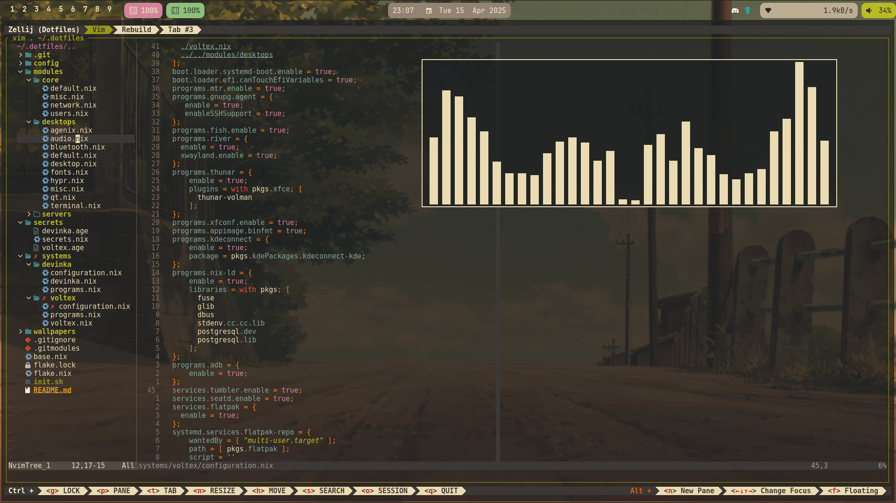
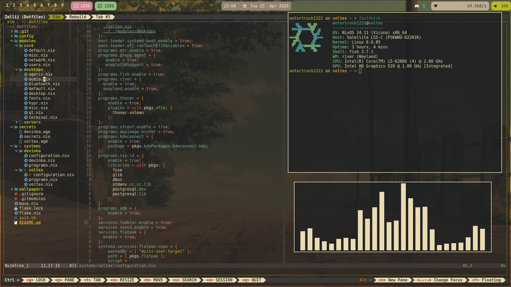
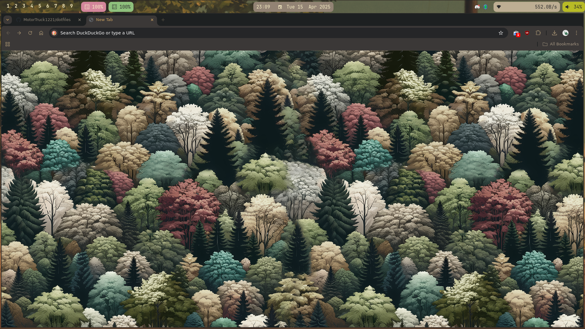
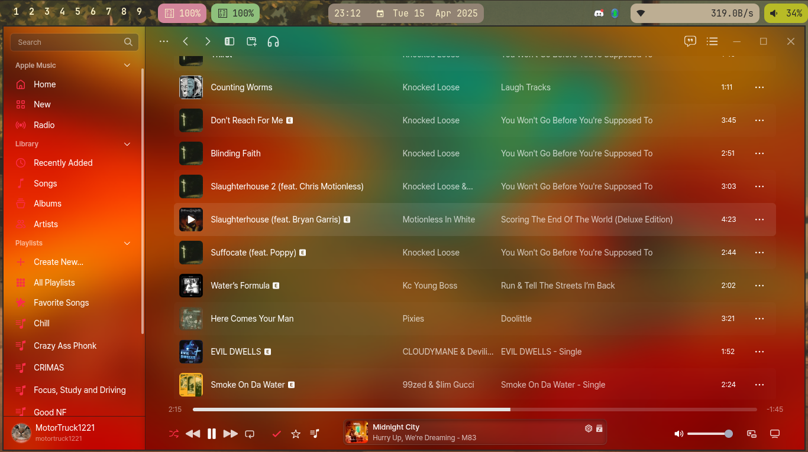
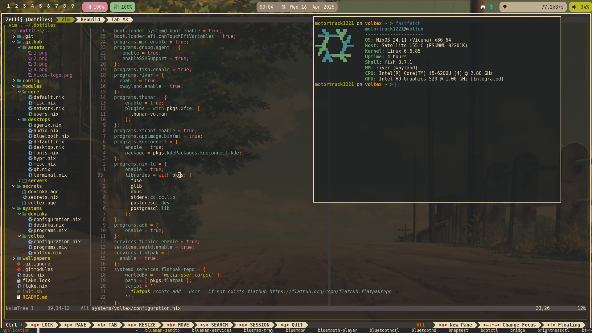

<h1 align="center">
        MotorTruck1221's Dotfiles
    <br>
</h1>

---
## Pictures
<p align="center">
     <br>
     <br>
     <br>
     <br>
     <br>
</p>

---
## Usage

1. Please don't use this, it's very scuffed LOL
2. Clone the repo
3. `sudo nixos-rebuild switch --flake .#yourdesktop`

I have an easy init.sh script ready to go in case you need to kick stuff off with ease. (after installation)
```bash
curl https://raw.githubusercontent.com/MotorTruck1221/dotfiles/refs/heads/main/init.sh | bash
```

---
## Layout
 - [flake.nix](./flake.nix) - Flake to get everything kicked off
 - [base.nix](./base.nix) - All of the base programs that are required on ALL systems
 - [systems/](./systems/) - Per system config
    - [voltex](./sytstems/voltex) - My main PC/Laptop
    - [devinka](./systems/devinka) - My home server
- [modules](./modules) - Modularized configs
    - [core](./modules/core) - Core config, may move base.nix here
    - [desktops](./modules/desktops) - Dektop based config
    - [server](./modules/servers) - A mor minimal server based setup
- [secrets](./secrets) - Stored secrets using [agenix](https://github.com/ryantm/agenix)
- [config](./config) - General dotfile config files, slowly this is going to be moved to the [modules](./modules) folder :p
- [wallpapers](./wallpapers) - All of my wallpapers as a **submodule** due to it being over 4GB's in size
---
## About

- I wanted this to be as modular as possible to manage all of the server and desktops/laptops I have.
- I didn't want to use Home Manager as this is my first time playing around w/NixOS and that seems like it abstracts tons

### What I wanna do later
- [ ] - Make a CLI that can install and be ready to go! (Maybe in Zig or some other language I would like to learn :p)
- [ ] - Clean this up slightly more

---

## Software used (some of it):

- WM - [river](https://codeberg.org/river/river)
- Bar - [waybar](https://github.com/Alexays/wayber) - Will be switched to [eww](https://github.com/elkowar/eww) at some point
- Application Launcher - [Bemenu](https://github.com/cloudef/bemenu)
- Music player - [Cider](https://cider.sh)
- Notification Daemon - [Dunst](https://github.com/dunst-project/dunst)
- Terminal - [Alacritty](https://github.com/alacritty/alacritty)
- Terminal Multiplexer - [Zellij](https://github.com/zellij-org/zellij)
- Shell - [Fish](https://github.com/fish-shell/fish) w/ [Fisher](https://github.com/jorgebucaran/fisher) & [Starship](https://github.com/starship/starship)
- Text Editor/IDE - [Neovim](https://github.com/neovim/neovim) w/ [Lazy.nvim](https://github.com/folke/lazy.nvim)
- File manager - [Thunar](https://gitlab.xfce.org/xfce/thunar) & [Ranger](https://github.com/ranger/ranger)
- Color Scheme - [Gruvbox Dark](https://github.com/morhetz/gruvbox)
- Lockscreen(s) - [Tuigreet](https://github.com/apognu/tuigreet) & [Hyprlock](https://github.com/hyprwm/hyprlock)
- Screenshots - [Hyprshot](https://github.com/gustash/hyprshot)
- Clipboard - [Wl-clipboard](https://github.com/bugaevc/wl-clipboard)
